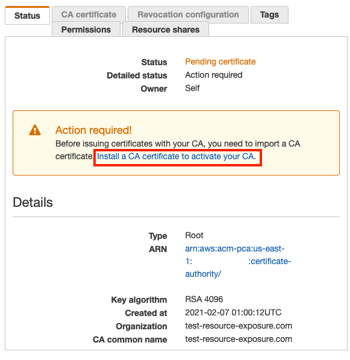

# ACM PCA

## Tutorial

### Setting up the demo resources

* Run the Terraform code to generate the example AWS resources.

```bash
make terraform-demo
```

The ACM Private Certificate Authority will have been created - but you won't be able to use it yet. Per [the Terraform docs on [aws_acmpca_certificate_authority](https://registry.terraform.io/providers/hashicorp/aws/latest/docs/resources/acmpca_certificate_authority), "Creating this resource will leave the certificate authority in a `PENDING_CERTIFICATE status`, which means it cannot yet issue certificates."

* To solve this, navigate to the AWS Console in the selected region. Observe how the certificate authority is in the `PENDING_CERTIFICATE` status, as shown in the image below.

> 

* Select "Install a CA Certificate to activate your CA", as shown in the image above, marked by the **red box**.

* A wizard will pop up. Use the default settings and hit **"Next"**, then **"Confirm and Install"**.

* Observe that your root CA certificate was installed successfully, and that the STATUS of the CA is ACTIVE and able to issue private certificates.

.. and now you are ready to pwn that root certificate with this tool 😈

### Exploit

## Resources

* [Attaching a Resource-based Policy for Cross Account Access in ACM PCA](https://docs.aws.amazon.com/acm-pca/latest/userguide/pca-rbp.html)
* [GetPolicy](https://docs.aws.amazon.com/acm-pca/latest/APIReference/API_GetPolicy.html)
* [PutPolicy](https://docs.aws.amazon.com/acm-pca/latest/APIReference/API_PutPolicy.html)
* [DeletePolicy](https://docs.aws.amazon.com/acm-pca/latest/APIReference/API_DeletePolicy.html)

